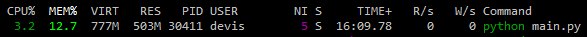
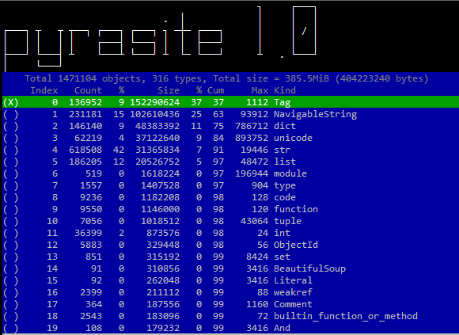
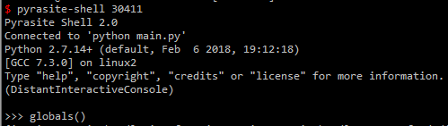

由于自己需要监控某站点的新贴，并实现通知提醒，用python写了一个爬虫爬取网站页，并分析是否有新贴链接，如为新贴链接则则下发通知。花了两天的时间coding-debug之后，上线运行得不错，至今监控到了6千多个新贴，并下发数万邮件通知和QQ、微信通知。
过了一段时间之后，发现服务器登陆缓慢，检查了一下才发现是内存快要耗尽，而占用内存最大的进程为自己的那条python进程。
<!-- more -->


这里面内存保存着几千条url链接，没理由占用这么大的内存，很可能内部元素没释放。

# 原理知识

内存管理，python内部所有的东西都为对象，又分为mutable和immutable对象，包含类型、函数等等。为了避免频繁的申请、释放内存，避免大量使用的小对象的构造析构，python有一套自己的内存管理机制。在巨著《Python源码剖析》中有详细介绍，在python源码obmalloc.h中也有详细的描述。

python由于有了垃圾回收，为什么还会有内存泄露呢？可能的原因如下：
1. 对象一直被全局变量所引用, 全局变量生命周期长.
2. 垃圾回收机被禁用或者设置成debug状态, 垃圾回收的内存不会被释放.
3. Python垃圾回收用于处理循环引用，但是无法处理循环引用中的对象定义了__del__的情况，而且每次回收会造成一定的卡顿

当一个对象已经不可达了，在我的理解这个对象已经不能通过任何变量去找到，但这个对象没有立即释放，那可能存在循环引用。

## 引用计数

引用计数（References count），指的是每个Python对象都有一个计数器，记录着当前有多少个变量指向这个对象。

将一个对象直接或者间接赋值给一个变量时，对象的计数器会加1；当变量被del删除，或者离开变量所在作用域时，对象的引用计数器会减1。当计数器归零的时候，代表这个对象再也没有地方可能使用了，因此可以将对象安全的销毁。Python源码中，通过Py_INCREF和Py_DECREF两个宏来管理对象的引用计数，代码在object.h

查看对象引用次数的工具可使用sys包
```
sys.getrefcount(obj)
```

# 检查工具

查看python内存泄露的工具蛮多的，这里简单介绍一下。

* gc: python 内置模块, 函数少功能基本, 使用简单, 作为python开发者里边的内容必须过一遍
* objgraph: 可以绘制对象引用图, 对于对象种类较少, 结构比较简单的程序适用, 我这个一个库套一个库, 内存还用的这么多,
* guppy: 可以对堆里边的对象进行统计, 算是比较实用
* pympler: 可以统计内存里边各种类型的使用, 获取对象的大小

上边这些虽然有用但是总是搞不到点子上, 上边这些都需要改我的源程序, 比较费劲, 线上的代码不是说改就能改的, 而且他们功能也都比较弱, 后来发现两个强大的工具:

* tracemalloc: 究极强, 可以直接看到哪个(哪些)对象占用了最大的空间, 这些对象是谁, 调用栈是啥样的, python3直接内置, python2如果安装的话需要编译
* pyrasite: 牛逼的第三方库, 可以渗透进入正在运行的python进程动态修改里边的数据和代码(其实修改代码就是通过修改数据实现)

我开始的时候非常想用tracemalloc, 可是对python2特别不友好, 需要重新编译python, 而且只能用python2.7.8编译, 编译好了也不容易嵌入到虚拟环境中, 头大, 果断换第二个.

## pyrasite

[pyrasite官网](http://pyrasite.com/)可以看到清晰的工具作用，另外还有[pyrasite-gui](https://github.com/lmacken/pyrasite-gui)可以使用


工具：pyrasite;包含三个命令行 `pyrasite` / `pyrasite-shell` / `pyrasite-memory-viewer`

pyrasite需要依赖另外三个工具：`gdb`、`meliae`、`urwid`，可以使用apt或者yum安装。

> 注: pyrasite使用之前需要在root用户下运行命令 `echo 0 > /proc/sys/kernel/yama/ptrace_scope`后才能正常使用

也可以设置`ptrace_scope=0`在`/etc/sysctl.d/10-ptrace.conf`中

pyrasite-memory-viewer, 功能和guppy差不多, 不过可以对内存使用统计和对象之间的引用关系进行快照保存, 很易用也很强大.运行

```
pyrasite-memory-viewer <pid>
```


这截图可以看出，内存中引用最多的还是bs4相关的对象，如:Tag、NavigableString，这两个东西，加起来占用超过一半达到62%，而dict等保存了url相关的内容，只占11%。

使用命令pyrasite-shell pid进入进程的shell，可以附加到想调试的进程，查看和修改进程的数据。



操作命令

```
import gc
import objgraph

gc.isenabled()
gc.set_debug(gc.DEBUG_COLLECTABLE | gc.DEBUG_UNCOLLECTABLE | gc.DEBUG_INSTANCES | gc.DEBUG_OBJECTS)
col = gc.collect()
print('unreachable object %d' % col)
print('garbage object num:%d' % len(gc.garbage))

### 打印出对象数目最多的 10 个类型信息  
>>> objgraph.show_most_common_types(limit = 10) 
dict                       164503
NavigableString            86315
list                       71620
Tag                        51132
function                   9655
ObjectId                   5919
tuple                      3447
builtin_function_or_method 2572
weakref                    2531
wrapper_descriptor         1513

d = gc.garbage[0]
>>> type(d)
<class 'bs4.BeautifulSoup'>

>>> objs = gc.get_referrers(d)
>>> type(bojs)
>>> len(objs)   ## 如果对象太大，注意只访问其中一两个对象

### 打印出一类对象的引用范围，例：NavigableString
>>> objgraph.show_backrefs(objgraph.by_type('NavigableString')[0], max_depth=10)

### 如果以上的输出含有gc.garbage列表的影响，则可以使用以下语句来排除gc.garbage的影响
>>> objgraph.show_backrefs(objgraph.by_type('NavigableString')[0], extra_ignore=(id(gc.garbage),),  max_depth = 10)

### 如果以上的命令显示的引用范围太大，看不懂，可以改用show_chain
>>> 
objgraph.show_chain(
    objgraph.find_backref_chain(
        objgraph.by_type('NavigableString')[0],
        objgraph.is_proper_module
    ),
    filename='obj_chain.dot'
)


# gvedit为windows自带的dot文件gui解析器
# 命令行
dot -Tpng -o test.png test.dot  
```

gc是正常工作的，而且使用gc.set_debug(gc.DEBUG_SAVEALL)设置gc为debug模式，然后gc.collect()进行垃圾回收发现并没有更多内存释放，则否认了第二种泄露的可能。

现在来看gc.garbage中不能被释放的对象, 让我来检查一下是否有全局变量指向它们(这里极有可能是一个列表或者是一个字典)。gc.garbage 可以看到被塞满了各种DicomFileLike对象


# 结局

核查到最后，每一次都是一大堆的NavigableString，回收也回收不了，一直存在引用，最后在源代码中发现原来BS4的strings和string方法返回的类型就是NavigableString，这返回值又保存到了类属性map中，于是gc也回收不了。最后改用了bs4的text方法，返回新的str对象。解决了大规模内存占用的问题。

# 参考资料

1. [Python内存泄露实战分析](https://www.linuxzen.com/python-nei-cun-xie-lu-shi-zhan-fen-xi.html)
2. [使用gc、objgraph干掉python内存泄露与循环引用](http://www.cnblogs.com/xybaby/p/7491656.html)
3. [程序员必知的Python陷阱与缺陷列表](http://www.cnblogs.com/xybaby/p/7183854.html)
4. [pyrasite官网](http://pyrasite.com/)
5. [pyrasite.pdf](https%3A%2F%2Fmedia.readthedocs.org%2Fpdf%2Fpyrasite%2Flatest%2Fpyrasite.pdf)