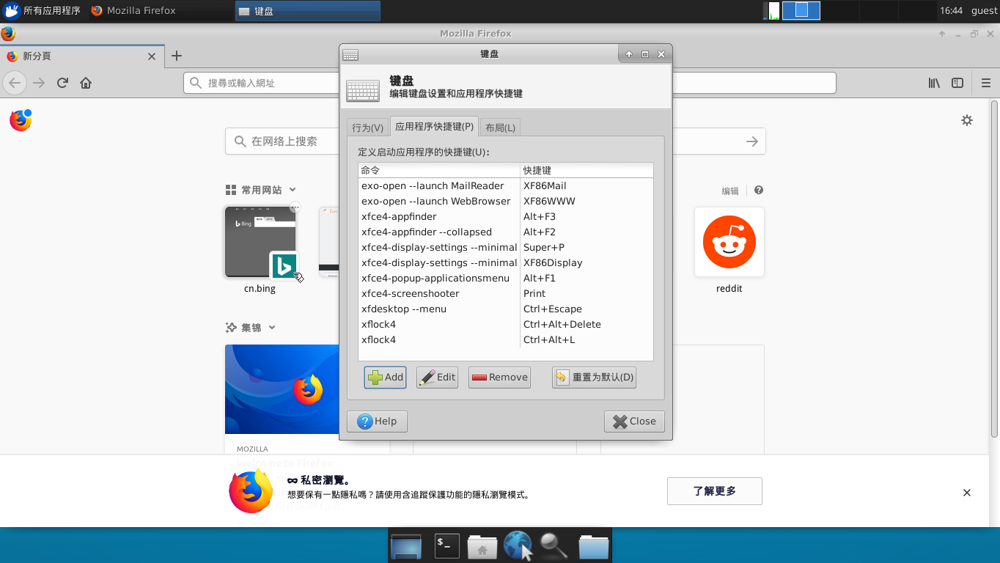

一直以来都想要实现一种个人工作环境保存方式，试过备份，试过dotfiles，试过github等等方式。docker的出现提供了一种新的方法，Docker改变了世界的开发部署运维方式，改变了传统计算的方方面面。Doeckfile中集中着日常开发所使用的软件，借助xrdp组件，实现了docker下的远程桌面部署，得以实现一个即开即用的开发桌面。

<!-- more -->
* * *

# 依赖
 - root或者docker组权限
 - docker 1.12版本以上，太低的版本我也没环境


# Dockerfile

这个docker容易使用的是Ubuntu 16.04，没有syslog，没有cron，没有日志归集压缩等功能，如果想要这些功能，可以From [phusion/baseimage](https://github.com/phusion/baseimage-docker)，这个image不到100M。

我的[Dockerfile github 仓库](https://github.com/wisfern/docker-ubuntu-xrdp-destop.git)

```dockerfile
FROM ubuntu:16.04
MAINTAINER wisfern@gmail.com

RUN sed -i 's#http://archive.ubuntu.com/#http://mirrors.aliyun.com/#;s#http://security.ubuntu.com/#http://mirrors.aliyun.com/#;s/# deb-src/deb-src/g' /etc/apt/sources.list

# Install packages
ENV DEBIAN_FRONTEND noninteractive
ENV BUILD_DEPS="git autoconf pkg-config libssl-dev libpam0g-dev \
    libx11-dev libxfixes-dev libxrandr-dev nasm xsltproc flex \
    bison libxml2-dev dpkg-dev libcap-dev"
RUN apt-get -y update \
    && apt-get -yy upgrade \
    && apt-get -yy install \ 
        apt-utils software-properties-common ca-certificates \
        xfce4 xfce4-terminal xfce4-screenshooter xfce4-taskmanager \
        xfce4-clipman-plugin xfce4-cpugraph-plugin xfce4-netload-plugin \
        xfce4-xkb-plugin xauth uuid-runtime pulseaudio locales pepperflashplugin-nonfree \
        sudo git wget make cmake vim zsh curl net-tools inetutils-ping \
        firefox supervisor openssh-server nginx firefox-locale-zh-hant \
        language-pack-zh-hant language-pack-gnome-zh-hant ttf-ubuntu-font-family \
        fonts-wqy-microhei python-pip python-dev build-essential \
        $BUILD_DEPS \
    && apt-get autoclean \
    && apt-get autoremove \
    && rm -rf /var/lib/apt/lists/* \

# Build rdkafka

WORKDIR /tmp
RUN git clone https://github.com/edenhill/librdkafka.git \
    && cd librdkafka \
    && ./configure \
    && make \
    && make install 

# Build xrdp

WORKDIR /tmp
RUN apt-get source pulseaudio \
    && apt-get build-dep -yy pulseaudio \
    && cd /tmp/pulseaudio-8.0 \
    && dpkg-buildpackage -rfakeroot -uc -b \
    && cd /tmp \
    && git clone --branch v0.9.5 --recursive https://github.com/neutrinolabs/xrdp.git \
    && cd /tmp/xrdp \
    && ./bootstrap \
    && ./configure \
    && make \
    && make install \
    && cd /tmp/xrdp/sesman/chansrv/pulse \
    && sed -i "s/\/tmp\/pulseaudio\-10\.0/\/tmp\/pulseaudio\-8\.0/g" Makefile \
    && make \
    && cp *.so /usr/lib/pulse-8.0/modules/

# Build xorgxrdp

WORKDIR /tmp
RUN apt-get -yy install xserver-xorg-dev \
    && git clone --branch v0.2.5 --recursive https://github.com/neutrinolabs/xorgxrdp.git \
    && cd /tmp/xorgxrdp \
    && ./bootstrap \
    && ./configure \
    && make \
    && make install

# Clean 

WORKDIR /
RUN apt-get -yy remove xscreensaver \
    && apt-get -yy remove $BULD_DEPS \
    && apt-get -yy autoremove \
    && apt-get -yy autoclean \
    && rm -rf /var/lib/apt/lists/* \
    && rm -rf /tmp/*

# Configure

ENV TZ=Asia/Shanghai
RUN ln -snf /usr/share/zoneinfo/$TZ /etc/localtime && echo $TZ > /etc/timezone \
    && dpkg-reconfigure locales \
    && locale-gen zh_CN.UTF-8 \
    && systemd-machine-id-setup
ENV LANG zh_CN.UTF-8
ENV LANGUAGE zh_CN:zh
ENV LC_ALL zh_CN.UTF-8

ADD bin /usr/bin
ADD etc /etc
#ADD pulse /usr/lib/pulse-10.0/modules/
RUN mkdir /var/run/dbus \
    && cp /etc/X11/xrdp/xorg.conf /etc/X11
#RUN sed -i "s/console/anybody/g" /etc/X11/Xwrapper.config
RUN sed -i "s/xrdp\/xorg/xorg/g" /etc/xrdp/sesman.ini
    && echo "xfce4-session" > /etc/skel/.Xclients \
    && cp -r /etc/ssh /ssh_orig \
    && rm -rf /etc/ssh/* \
    && rm -rf /etc/xrdp/rsakeys.ini /etc/xrdp/*.pem \
    && useradd -m -d /home/guest -p guest guest --groups adm,sudo \
    && echo 'guest:docker' | chpasswd \
    && chsh -s /bin/zsh guest \
    && cd /opt && git clone https://github.com/wisfern/dotfiles.git \
    && chmod -R o+w dotfiles && cd dotfiles && make zsh

# Docker config

VOLUME ["/etc/ssh","/home"]
EXPOSE 3389 22 9001

ENTRYPOINT ["/usr/bin/docker-entrypoint.sh"]
CMD ["supervisord"]
```


# 使用方法

登陆到docker权限的用户，docker级成员或者root，执行命令

```shell
1. 检出仓库
git clone https://github.com/wisfern/docker-ubuntu-xrdp-destop.git
cd docker-ubuntu-xrdp-destop

2. 构建镜像
docker build -t wisfern/ubuntu-xrdp:v0.1.0 .

3. 启动容器
docker run -d \
  --name uxrdp \
  -p 6080:80 -p 13389:3389 -p 2222:22 -p 9001:9001 -p 4000:4000 \
  -v /srv:/srv \
  ubuntu-xrdp
  
4. 连接远程桌面
rdp 172.16.xx.xx:13389
用户名: guest
密码: docker
```

命令中映射目录到容器里面，是个人习惯，可选动作。


# 效果截图




## 添加XFCE4截图功能

上面的截图正在添加截图功能，首先

```shell
apt-get install xfce4-screenshooter
```

然后在界面上的菜单路径

```shell
Applications=>Settings=>Keyboard=>Application Shortcuts
```

增加快捷键，输入xfce4-screenshooter，如上图，按下OK后会出现一个新的对话框，按下键盘右上方的PrintScreen即可。


# 参考资料

1. [fcwu/docker-ubuntu-vnc-desktop](https://github.com/fcwu/docker-ubuntu-vnc-desktop)