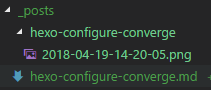

# Hexo配置
## 主配置
包含归档页、Tag页、about页、侧边等等的配置

配置文件：https://hexo.io/docs/configuration.html
总文档：https://hexo.io/zh-cn/docs/index.html
新手教程：https://yaoandy107.github.io/hexo-tutorial/

### 页头页尾
可以写上版权、打赏等功能、用第三方服务集成阅读时长、阅读次数等功能

## 图片资源
hexo有两个地方可以存着站内资源，这里的资源包括图片、视频、声音等，而在markdown文章中可以引用的URL如下：
1、完整的URL网址，例如：https://avatars1.githubusercontent.com/u/32269?v=3&s=460
2、站内地址：
    * /uploads/xxx.jpg，需要将图片资源保存在hexo/source/uploads目录下（新建uploads)
    * /images/xxx.jpg，需要将图片资源保存在hexo/source/images目录下，也可以保存在主题的source目录，道理一样的。

* xxx.jpg，这种存在于文章的同级同名目录之下，需要打开hexo的配置并安装一个插件。

```shell
# 由于CodeFalling改的hexo-asset-image与hexo-abbrlink不兼容，生成的图片链接无法成功显示，因此换成我自己修改的版本
npm install https://github.com/wisfern/hexo-asset-image --save
再把 hexo _config.yml 中更改 post_asset_folder:true
```
最后，很多人使用了图床，这极大地方便着博客markdown的迁移，可以使我们的文章到处渲染。当然，我目前还没使用图床。

参考资源：https://www.tuicool.com/articles/umEBVfI

### VS Code使用图片插件

曾经有一段时间是在vscode这个开源的编辑器下写博文，因为这个编辑器通过第三方插件可以实现相当丰富的功能，其中就包含Markdown预览，复制图片，以及hexo博客的支持。

vscode的图片插件使用Paste Image，这个插件直接截图保存在指定的目录，我们可以配置为当前文章所在的目录的文章同名子目录，是不是很熟悉。

插件配置

```
{
    "pasteImage.path": "${currentFileDir}/${currentFileNameWithoutExt}"
}
```

指定图片存放位置为：当前文件所在目录，以当前文件名命名的子目录。

url默认为以当前文件名命名的目录。

保存的时候，可以选择一段自定义文字，然后再按`ctrl+alt+v`复制进markdown，作为图片文件名，效果如下：

```markdown
复制后的markdown文字

```

效果


## 主题配置
个人使用的Next主题，安装方法见Next主题官网。安装后把Next主题的\_config.yml配置复制一份到hexo/source/\_data/next.yml，后续就修改这个文件即可。
```shell
cp themes/next/_config.yml source/_data/next.yml
```
Next主题由于我打开了fancybox特效，因此需要安装fancybox主题插件。
在主题themes/next目录下
```shell
git clone https://github.com/theme-next/theme-next-fancybox3 source/lib/fancybox
```

参考资料：
[Next主题配置文档](https://github.com/iissnan/hexo-theme-next/wiki/%E4%B8%BB%E9%A2%98%E9%85%8D%E7%BD%AE%E5%8F%82%E8%80%83)

## 插件配置
安装如下插件，这里也把上下文涉及到的插件都集中到这里
``` shell
npm install https://github.com/CodeFalling/hexo-asset-image –save
npm install hexo-deployer-git --save     # 部署到github page
npm install hexo-abbrlink --save
npm install hexo-neat --save
```


# 部署

hexo的public目录里面的静态文件就是网站的html/css/js文件数据，这些文件都由hexo使用source目录的数据渲染而生成。
## github部署
要部署到github page，则需要先安装一个插件
``` shell
npm install hexo-deployer-git --save
```
如果遇到密码保存问题，可以用git-credential-store模块来解决。
参考
```shell
man git | grep -C 5 password
man git-credential-store
```
启用命令
```shell
git config credential.helper store   # cache则表示保存到内容缓存，默认缓存15分钟，加--timeout=3600可以改为1个小时，例：'cache --timeout=3600'
```
这样第一次输入密码后，密码则以明文方式保存在如下文件
```shell
file ~/.git-credentials
cat ~/.git-credentials
```

git密码保存问题参考[github配置](https://help.github.com/articles/set-up-git/#next-steps-authenticating-with-github-from-git)，如果上面这种https方式无法解决问题（主要是credential数据会过期）可以尝试使用ssh密钥连接github.com。

### README.md

由于渲染机制，README.md文件需要在hexo/source目录编写，并在hexo/\_config.yml的skip_render配置项追加README.md，表示不需要渲染。
``` yml
# Directory
skip_render: README.md
```

### 顶级域名
github.com提供了一个机制让我们绑定自己的顶级域名，在github page的根目录新建一个CNAME文件，文件的内容就是一行自己的顶级域名，如wisfern.com，然后保存。
而在hexo中，部署到github page的渲染源内容都是source目录，因此此文件必须保存于hexo/source/CNAME。最后重新生成并部署站点。

CNAME案例

```
domain.com
```

设置域名解析
1、先添加一个CNAME，主机记录写@，后面记录值写上你的*user*.github.io
2、再添加一个CNAME，主机记录写www，后面记录值也是*user*.github.io
这样别人用www和不用www都能访问你的网站（其实www的方式，会先解析成https://user.github.io，然后根据CNAME再变成http://www.domain.com，即中间是经过一次转换的）。
注：除了使用CNAME记录也有人使用A记录，后面的记录值是写github page里面的ip地址，但有时候IP地址会更改，导致最后解析不正确，所以还是推荐用CNAME别名记录要好些，不建议用IP。
3、等待10分钟左右，域名生效后刷新浏览器，使用自定义域名访问网站即可

更详细的可以参考[github page custom domain](https://help.github.com/articles/using-a-custom-domain-with-github-pages/)

## Travis-CI 持续部署

使用CI工具持续部署github page，当然这个CI可以做的东西远不此这个。

[我的.travis.yml脚本](https://github.com/wisfern/wisfern.github.io/blob/hexo/.travis.yml)

参考资料

[Travis-CI持续部署Hexo](https://segmentfault.com/a/1190000009054888)


# 优化

## 内容压缩
hexo渲染生成的静态文件，都存在着大片的空白，可以通过如下插件解决，得以加快网页加载速度。
安装方法：
```
npm install hexo-neat --save
```
配置方法：
``` yml
# hexo-neat

neat_enable: true

neat_html:
  enable: true
  exclude:
  
neat_css:
  enable: true
  exclude:
    - '*.min.css'

neat_js:
  enable: true
  mangle: true
  output:
  compress:
  exclude:
    - '*.min.js'
```

## SEO优化
Hexo博客可以有如下几种方式来优化SEO。
### 生成sitemap文件
1、安装相关插件

### Url持久化
hexo默认的url比较长，形如:year/:month/:day/:title/，对搜索不友好。
这里借助一个插件实现URL优化，结果见本博的URL地址。
``` shell
npm install hexo-abbrlink --save
```
注释掉hexo\_config.yml中的permalink，改为如下：
``` shell
#permalink: :year/:month/:day/:title/
permalink: archives/:abbrlink.html
abbrlink:
alg: crc32  # 算法：crc16(default) and crc32
rep: hex    # 进制：dec(default) and hex
```
> 注：html前缀为：对标题+时间进行md5然后再转base64


# 备份与恢复

## 备份
github仓库使用两个分支，master分支用于博客发布(命令：*hexo d*)，而hexo分支用于备份hexo、配置、代码、文章等。
``` shell
git checkout hexo
git ci -am "commit message..."
git push origin hexo
```

## 恢复
我们在另外一台电脑上恢复环境，命令如下：
``` shell
git clone --branch hexo --recursive https://github.com:wisfern/wisfern.github.io.git
cd wisfern.github.io/
git submodule init
git submodule update
//接下来的任务主要是配置环境，nodejs安装，hexo等等。以下安装可能不全面
npm install -g hexo
npm install hexo-cli -g
npm install hexo --save
npm install hexo-server --save
npm install hexo-deployer-git --save
npm install
```


# Hexo编辑器

* [HexoEditor](https://github.com/zhuzhuyule/HexoEditor) 本地Hexo博客文章编写器，博主主要使用这个编辑器。
* [hexo-editer](https://github.com/tajpure/hexo-editor) 通过网络服务来编写文章，目前最大的缺点就是针对front-mapper的支持不是很好，有精力的朋友可以按自己的要求再改改代码。
* [hexo-cli-extras](https://github.com/greg-js/hexo-cli-extras) 此插件支持在命令行按分类、标签、文章列表、时间、目录、布局等来筛选文章并打开文本编辑器编辑。


# 参考资料

1、[How do I add a README.md file into the root directory of the generated blog by HEXO?](https://stackoverflow.com/questions/25258660/how-do-i-add-a-readme-md-file-into-the-root-directory-of-the-generated-blog-by-h/31051913#31051913)
2、[About supported custom domains](https://help.github.com/articles/about-supported-custom-domains/)
3、[hexo-abbrlink介绍](https://segmentfault.com/a/1190000005799711)
4、[theme-next/theme-next-fancybox3](https://github.com/theme-next/theme-next-fancybox3)
5、[Rozbo/hexo-neat介绍](https://github.com/Rozbo/hexo-neat)
6、[hexo博客压缩优化](https://segmentfault.com/a/1190000008082288)
