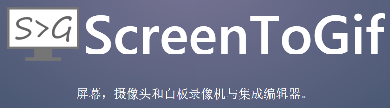
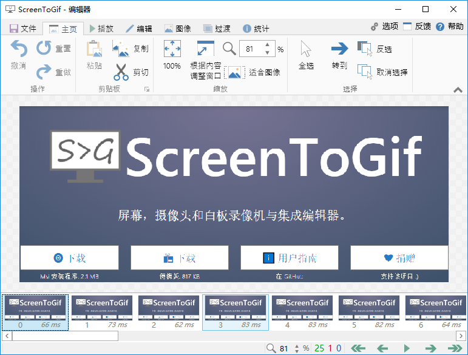
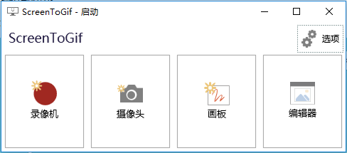
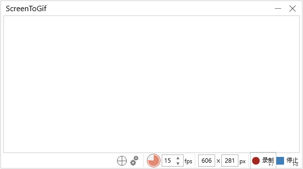
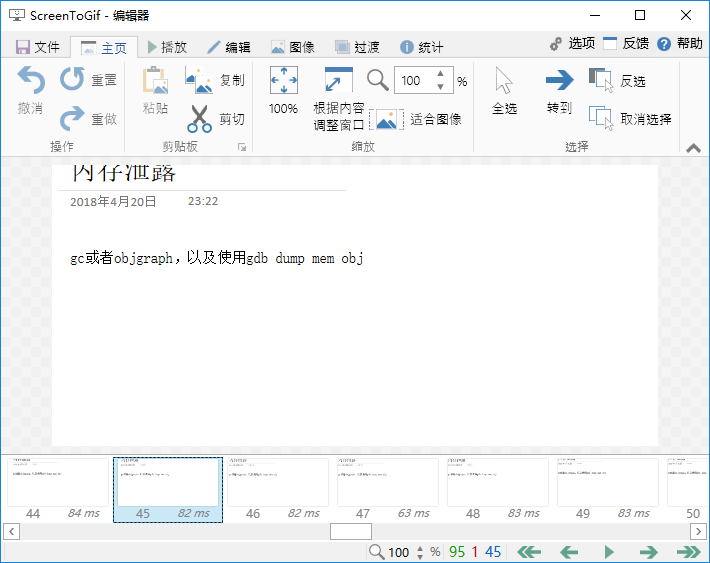

经常会遇到一些场景，需要你向别人展示一些操作或是效果——例如告诉别人某某软件的配置步骤啊、刚某个动画效果怎么样啊、某某电影里面的一个镜头多么经典啊、打得大快人心的NBA绝杀瞬间是怎么回事啊，等等…. 这些场合，如果单纯截成图片有时难以说清楚，但录成视频又不方便在社交软件上传播，这时就需要一个能够生成动态图的软件：

<!-- more -->

## 软件简介

ScreenToGif 也是一款非常**轻便的**、**完全免费的**、**没广告的**，**免安装的**【屏幕录制软件】，它可以用来快速录制屏幕上的指定区域，并将其直接保存为**GIF动态图**。录制后还可以对gif进行编辑，例如删除不合适的某一帧、添加滤镜效果等。软件大小**只有两三M**，绿色版本更小只有**800多KB**，界面也非常**简洁**，启动速度**快**，操作**简单**易上手。

ScreenToGif这个项目以Ms-PL协议开源，由 Nicke Manarin 于2013年发起，其源代码已发布在[Github上](https://link.zhihu.com/?target=https%3A//github.com/NickeManarin/ScreenToGif)，具体细节可以到其[官方主页](https://link.zhihu.com/?target=http%3A//www.screentogif.com/)获悉（本答底部有下载链接）。

## 软件使用

双击运行后：

最左边那个Recorder点进去就是**录制屏幕**了，第二个Webcam是捕获电脑摄像头画面，第三个Board是录制画板，最后一个编辑素材用。

可以随意拖动边框调整屏幕捕获窗口的大小（下面小格里的“15”是每秒帧速，可调）：

录制完成后在编辑界面下方会显示具体的每一帧（点击菜单项View可以播放方才录制的动图），有哪一帧不想要的可以直接删除，非常方便：

该软件还有许多其他的编辑功能，例如添加文字，旋转、裁剪素材，涂鸦等等。另外，在设置里面还有许多选项可以选择，例如快捷键、生成gif质量、语言等等。

## 总结

ScreenToGif是一款**轻便实用**的【屏幕录制工具】，通过它可以轻松地把一些桌面操作等效果录制成gif图片。无论你是要截下一个精彩的NBA绝杀镜头，还是要录制一个电脑操作教程，亦或是一个演示，它都能帮你轻松高效地完成任务。