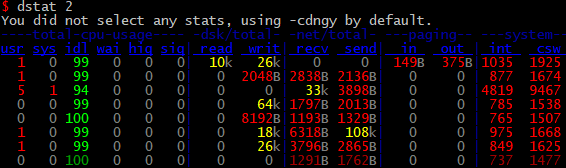

在linux终端下工作无法像windows一下有熟悉的网络工具可以诊断或者查看网络问题或者说结果没有那么直观，因此收集了几款个人在linux下诊断Linux性能问题的工具，以防忘记到处查找。涉及到CPU、磁盘IO、网络IO、进程诊断等。
<!-- more -->

# CPU性能

负载的话，一般使用top或者uptime，可以大概地看出一段时间内系统的CPU负载，主要指标是CPU等待中的进程数以及CPU占用运行中的进程数，一段时间内的负载数，最好不要超过CPU核心数。

## glances

这里把glances放在第一个讲，因为这个着实强大，几乎可以看到所有的性能数据，包含docker里面的镜像。它由`Python`编写，使用`psutil`库来从系统抓取信息的基于`curses`开发的跨平台命令行系统监视工具。 通过`Glances`，我们可以监视`CPU`，`平均负载，内存`，`网络流量`，`磁盘 I/O`，`其他处理器`和`文件系统`空间的利用情况。
一张运行截图：

> 按`1`切换全局 CPU 使用情况和每个 CPU 的使用情况，按`i` 读写频率（I/O）对进程排序，按`m`则按内存占用率排序，按`c`则按cpu使用率排序。

Glances 中颜色的含义
- 绿色：OK（一切正常）
- 蓝色：CAREFUL（需要注意）
- 紫色：WARNING（警告）
- 红色：CRITICAL（严重）

另外，`glances -s/-c`可以监控远程计算机，`-s`设置为服务端，`-c -P xxx.xxx.xxx.xxx`客户端连接，更具体情况请参考man。

## dstat/vmstat

> 上图可以很方便地看出cpu、磁盘、内存、网络、页面等性能数据，当然，要细化的话，还要再借用其他工具。
dstat默认使用了`-cdngy`参数，表示输出cpu\磁盘\网络\页面\系统状态，dstat工具的help信息，可以看出，还可以输出socket、tcp、平均负载等信息，如下：
`dstat -av`按vmstat的格式输出

`vmstat 2`每两秒输出一行数据

## top/htop

top，一般的Linux套件都自带，而htop则需要自己安装，在服务器上面的话，一般都只使用top，所以top还是要学习与掌握。
htop，由于有了glances之后，很少打开。

> tips: 按1打开cpu核心视图，按u后输入用户名，只显示此用户名下的进程，按c显示完整的命令，按i的话，则按进程idle值进行排序，按F选择排序字段。

## sar

CPU使用率和I/O等待时间都是在不断变化的，可以通过sar 命令来确认这些指标。该工具包含在sysstat软件包内。
一张使用截图，显示过去一段时间的值列表:

每秒输出统计值，连续10次，命令`sar 1 10`：

输出各网络端口的统计列值，每2秒输出一次共2次，命令：`sar -n DEV 2 2`

字段说明
IFACE：LAN接口
rxpck/s：每秒钟接收的数据包
txpck/s：每秒钟发送的数据包
rxbyt/s：每秒钟接收的字节数
txbyt/s：每秒钟发送的字节数
rxcmp/s：每秒钟接收的压缩数据包
txcmp/s：每秒钟发送的压缩数据包
rxmcst/s：每秒钟接收的多播数据包

# 网络性能工具

一直以来，我也找不到方便使用的性能收集与统计工具，最主要的还属`netstat`，在`windows`下我使用的是360公司出的`GlassWire`，这是一款windows自带防火墙的GUI，可以很方便地看到网络连接、速率等信息，按主机、进程、用户等分组统计流量用量，进程版本更新等等功能，而在Linux我还没有找到替代软件。

## netstat

几乎所有的Linux系统都会默认包含netstat命令，是net-tools工具集中的一员。

常用显示监听端口与对应的进程号命令：`netstat -tunpl`(此命令-p要在root才能显示进程号，非root只显示本用户所打开的进程号)

> -u表示显示udp，-l表示只列出监听，-n表示只显示数字不需要对ip做dns处理

另外，当服务器的连接非常大的时候，使用netstat就非常不方便了，这个时候就可以使用`ss`(Socket Statistics)命令替代`netstat`。

## ss

ss命令是iproute工具集中的一员，正好可以用来替代`netstat`，在这里有必要讲一下，iproute其实可以替代net-tools包了，如下表：

| 用途           | net-tool(淘汰) | iproute          |
| -------------- | -------------- | ---------------- |
| 地址和链路配置 | ifconfig       | ip addr, ip link |
| 路由表         | route          | ip route         |
| 邻居           | arp            | ip neigh         |
| VLAN           | vconfig        | ip link          |
| 隧道           | iptunnel       | ip tunnel        |
| 组播           | ipmaddr        | ip maddr         |
| 统计           | netstat        | ss               |

### 典型使用场景

１、服务器连接统计，命令`ss -s`

2、服务所有的tcp、udp监听，显示进程号，并以数字显示ip地址和端口，命令`ss -tunlp`,如果显示不够宽还是`netstat -tunlp`好看。

3、netstat与ss,ip命令的关系

## nethogs

用此工具可以实时显示各个进程的网络连接，[nethogs](https://www.vpser.net/manage/nethogs.html)可以在这里看到更详细的教程，这里只记录简单的日常用法，以及截图。
使用例子: 监控eth0网卡`nethogs eth0`

> 这东西，看起来比`iftop`好，这里就不介绍`iftop`，有兴趣再网上找资料学习。

# 磁盘IO

## iostat

场景：查看各磁盘分区的io使用率，命令`iostat -x 2`，2表示，每两秒输出一次

> 这个工具选项，我一般看最后一列的百分比，越接近100%越忙

# 三张神图

网上有人总结了Linux性能工具大全的神图，把Linux性能的方方面面都包含在里面。如下

# 各种监控平台

todo: 后补吧，手头上没有现成的。