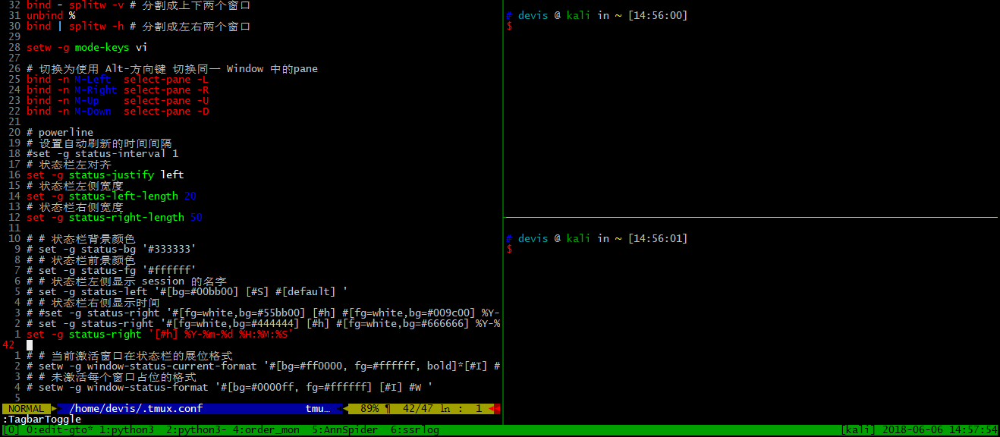

# TMUX 自定义配置


TMUX 号称是文本处理的“三大神器”之一，不是没有理由的。最近工作上好多事情都要在服务器上处理，所以用 TMUX 特别频繁。

最近花了点时间自己配置了一下 TMUX，这里权当记录一下吧。
<!-- more -->

## 1. 自动加载配置文件

在使用 TMUX 的时候，如果要重新加载配置文件，需要 `Ctrl + a` 触发，然后输入 `: + source-file + ~/.tmux.conf` 。

因为在调试配置的时候需要反复尝试，所以把这个配置做成了快捷键 `Ctrl + a + R` 。

```
bind R source-file ~/.tmux.conf
```

## 2. 采用 Vi 模式的快捷键

开启之后在复制模式（copy-mode，`Ctrl + a + ?`）中可以使用 Vi 模式下的快捷键。

```
setw -g mode-keys vi
```

## 3. 鼠标支持

对于鼠标的支持表现在通过鼠标的点击切换 window、pane 以及通过拖曳更改 pane 的大小。

注意的是 TMUX 版本的不同设置方式也不同。我的 MacBook Pro 使用的是 2.1，而我经常登录的服务器上使用的是 1.6。查看 TMUX 版本的命令是：

```
tmux -V
```

如果是 2.1 的话，设置为：

```
set -g mouse on
```

如果是 1.6 的话则设置为：

```
set -g mouse-select-window on
set -g mouse-select-pane on
set -g mouse-resize-pane on
```

## 4. `pane`的快捷键

默认的设置中，`pane` 的切换的快捷键是 `Ctrl + a + 方向键`，为了更便捷地进行切换，定义了新的快捷键 `Alt + 方向键` 。

```
# 切换为使用 Alt-方向键 切换同一 Window 中的pane，只是在CRT中貌似没有效果。
bind -n M-Left select-pane -L
bind -n M-Right select-pane -R
bind -n M-Up select-pane -U
bind -n M-Down select-pane -D
```

顺便把分屏快捷键改为`Ctrl + a + |`和`Ctrl + a + -`，很直观，一个竖分屏，一个是横分屏。

```
unbind '"'
bind - splitw -v # 分割成上下两个窗口
unbind %
bind | splitw -h # 分割成左右两个窗口
```

## 5. 自定义状态栏

TMUX 可以自定义状态栏的颜色和展示信息。首先给出我暂时使用的配置：

```
# 自动重新编号 window
set -g renumber-windows on

# 设置自动刷新的时间间隔
set -g status-interval 1
# 状态栏左对齐
set -g status-justify left
# 状态栏左侧宽度
set -g status-left-length 20
# 状态栏右侧宽度
set -g status-right-length 50

# 状态栏右侧显示时间
set -g status-right '[#h] %Y-%m-%d %H:%M:%S'
# 用习惯了默认的状态栏，不修改其他了，只改了时间显示样式
```

有几个配置需要进行说明一下：

### 5.1 关于时间的配置

上文配置中，我采用了几个时间参数显示在了状态栏的右侧：

| 参数形式 | 参数含义 |
| -------- | -------- |
| %Y       | 年：2016 |
| %m       | 月：07   |
| %d       | 日：03   |
| %H       | 小时：02 |
| %M       | 分钟：19 |
| %S       | 秒：04   |

需要注意的是其实这个时间的刷新是有间隔的，我们可以通过设置参数：

```
set -g status-interval 1
```

使得状态栏的时间好像每一秒都在变化。

### 5.2 颜色配置

TMUX 的状态栏中可以按照 `#[bg=colourxx,fg=#ffffff]` 的形式定义颜色的前景和背景。颜色的类型指定如：**black**, **red**, **green**, **yellow**, **blue**, **magenta**, **cyan**, **white** 。也可以是**colour0** 到 **colour255**。或者形如 `#ffffff` 的 RGB 格式。同时还可以针对字体进行设置：**bright** (or **bold**), **dim**, **underscore**, **blink**, **reverse**,**hidden**, or **italics**。

`#[default]` 可以重置修改后的样式。

### 5.3 其他配置参数

| 参数名称 | 参数含义         |
| -------- | ---------------- |
| #H       | 完整主机名       |
| #h       | 不含域名的主机名 |
| #F       | 窗口的标记       |
| #S       | session 的名字   |
| #I       | window 的序号    |
| #W       | 窗口的名字       |

此外，我们还可以通过 `#(shell_cmd)` 的形式运行 shell 命令来增强显示。我们还可以通过`#{VARIABLE}` 的形式使用 TMUX 中的各种变量。

1. 条件变量，例如：`#{?session_attached,attached,not attached}`。如果 `?` 后面的变量存在并且非 0 则返回第一个变量，否则返回第二个。
2. 变量字符串截取 `#{=N:VARIABLE}` 的形式获取变量的前 N 个字符， `#{=-N:VARIABLE}`获取变量的后 N 个字符。
3. 如果变量是时间戳类型的，`#{t:VARIABLE}` 会把时间戳转换为时间字符串。
4. `#{d:VARIABLE}` 返回变量的 `dirname`，`#{d:VARIABLE}` 返回 `basename`。

更多相关配置可见于：[FORMATS](http://man.openbsd.org/OpenBSD-current/man1/tmux.1#FORMATS)

## 6. 我的配置

以下是我的配置，部分配置还是以 2.7 为准。

```
# 修改快捷呼出键为Ctrl+a
unbind ^b
bind a send-prefix

unbind '"'
bind - splitw -v # 分割成上下两个窗口
unbind % 
bind | splitw -h # 分割成左右两个窗口

# 绑定 R 重载配置文件
bind R source-file ~/.tmux.conf

# 采用 vi 模式
setw -g mode-keys vi

# 基本设置
set -g default-terminal "screen-256color"
setw -g utf8 on
set -g status-utf8 on

# 设定状态栏的位置
set -g status-position bottom

# 状态栏配置 {
    # 自动重新编号 window
    set -g renumber-windows on
    # 自动命名窗口打开
    set-option -g allow-rename on

    # 设置自动刷新的时间间隔
    set -g status-interval 1
    # 状态栏左对齐
    set -g status-justify left
    # 状态栏左侧宽度
    set -g status-left-length 20
    # 状态栏右侧宽度
    set -g status-right-length 50

    # 状态栏右侧显示时间
    set -g status-right '[#h] %Y-%m-%d %H:%M:%S'
# }

# tmux 控制相关的配置 {
    # 允许鼠标选取 Window 、Pane 以及 Pane 的大小改变，2.7 时使用如下设置
    set -g mouse on
    # 同上，1.6 时如下设置
    #set -g mouse-select-window on
    #set -g mouse-select-pane on
    #set -g mouse-resize-pane on

    # 切换为使用 Alt-方向键 切换同一 Window 中的pane
    bind -n M-Left select-pane -L
    bind -n M-Right select-pane -R
    bind -n M-Up select-pane -U
    bind -n M-Down select-pane -D
# }
```

每次学一个这样的高频度软件，都觉得开源世界真尼玛高深莫测，每个软件都有如此复杂的可定制性！还都是免费的！

## 7. 参考资料

- [Making tmux Pretty and Usable – A Guide to Customizing your tmux.conf](http://www.hamvocke.com/blog/a-guide-to-customizing-your-tmux-conf/)
- [tmux](http://man.openbsd.org/OpenBSD-current/man1/tmux.1)