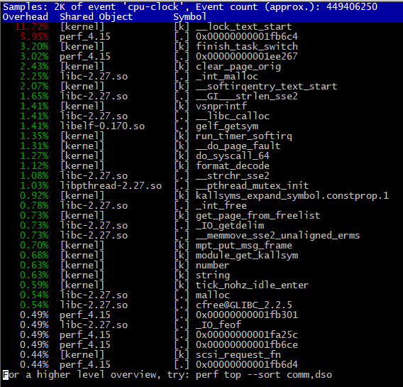

诊断程序性能问题，跟医生诊断病人，套路一样。只是现在的医生手里一堆检查工具，什么ct、dt、B超、内镜等等都可以帮助医生查明病因。而程序性能诊断，从cpu占用到内存占用，再到io占用等等，这些原则与手段是在操作系统这个层面来看程序的性能问题，往往没有直接看程序调用栈时间的长短来得直接。好在现在有个火焰图（Flame Graph）的工具可以使用，可以很方便了解性能问题。
<!-- more -->

常见的火焰图类型有 On-CPU，Off-CPU，还有 Memory，Hot/Cold，Differential 等等。下面给出bash程序的 On-CPU 类型的火焰图例子：


> 其中，y轴表示栈的深度，x轴表示样本的总数，栈帧的宽度表示了profile文件中该函数出现的比例，最顶层表示正在运行的函数，再往下就是调用它的栈 

关于火焰图详细的介绍可以参考 [Blazing Performance with Flame Graphs](http://www.slideshare.net/brendangregg/blazing-performance-with-flame-graphs)，纵向表示调用栈的深度，横向表示消耗的时间。因为调用栈在横向会按照字母排序，并且同样的调用栈会做合并，所以一个格子的宽度越大越说明其可能是瓶颈。综上所述，主要就是看那些比较宽大的火苗，特别留意那些类似平顶山的火苗。 

# Tracer工具

要生成火焰图，必须要有一个顺手的 [Tracer](http://www.brendangregg.com/blog/2015-07-08/choosing-a-linux-tracer.html) 工具，如果操作系统是 Linux 的话，那么选择通常是 [perf](http://www.brendangregg.com/perf.html)，[systemtap](https://sourceware.org/systemtap/) 中的一种。其中 perf 相对更常用，多数 Linux 都包含了它，有兴趣的读者稍后可以参考 [Linux Profiling at Netflix](http://www.slideshare.net/brendangregg/scale2015-linux-perfprofiling) 中的介绍，尤其是里面关于如何处理 Broken stacks 问题的描述，建议多看几遍，而 systemtap 相对更强大，不过缺点是你需要先学会它本身的编程语言，如果你和我一样觉得麻烦，那么我强烈推荐你使用[春哥](http://weibo.com/agentzh)的 [nginx-systemtap-toolkit](https://github.com/openresty/nginx-systemtap-toolkit)，乍一看名字你可能会误以为这个工具包是 nginx 专用的，实际上这里面很多工具适用于任何 C/CPP 语言编写的程序：

- [sample-bt](https://github.com/openresty/nginx-systemtap-toolkit#sample-bt)：用来生成 On-CPU 火焰图的采样数据（[DEMO](http://openresty.org/download/user-flamegraph.svg)）
- [sample-bt-off-cpu](https://github.com/openresty/nginx-systemtap-toolkit#sample-bt-off-cpu)：用来生成 Off-CPU 火焰图的采样数据（[DEMO](http://agentzh.org/misc/flamegraph/off-cpu-lua-resty-mysql.svg)）
- 以上基于systemtap编写的采集脚本，不适用于perf。

那么什么时候使用 On-CPU 火焰图？什么时候使用 Off-CPU 火焰图呢？取决于当前的瓶颈到底是什么，如果是 CPU 则使用 On-CPU 火焰图，如果是 IO 或锁 则使用 Off-CPU 火焰图。如果无法确定，那么可以通过压测工具来确认：通过压测工具看看能否让 CPU 使用率趋于饱和，如果能那么使用 On-CPU 火焰图，如果不管怎么压，CPU 使用率始终上不来，那么多半说明程序被 IO 或锁卡住了，此时适合使用 Off-CPU 火焰图。如果还是确认不了，那么不妨 On-CPU 火焰图和 Off-CPU 火焰图都搞搞，正常情况下它们的差异会比较大，如果两张火焰图长得差不多，那么通常认为 CPU 被其它进程抢占了。

## debuginfo

在生成完整的trace信息，必须要有完整的debuginfo，当一个程序缺失某些debuginfo，那么 gdb 会在结尾提示你用 debuginfo-install 命令来安装，坏消息是如果你直接运行多半没有效果，因为 CentOS 缺省没有激活对应的仓库，所以需要在`/etc/yum.repos.d/CentOS-Debuginfo.repo`中设置 enabled=1。

如果没有火焰图，我们可能会在解决一个问题后引入另一个问题。

实际使用火焰图的时候，因为 perf / systemtap 本身对系统性能影响较小，所以我们可以在线上随时采样数据来分析性能，我们甚至可以写一个脚本，自动化定期绘制系统运行状况的火焰图，如此一来，即便发生性能故障时我们没有第一时间在现场，也可以随时根据火焰图历史快照来确诊问题的根源。

看一个perf top的输出：

这里只看出哪一个函数为cpu使用大户，并不知道其调用链，而且这个工具还需要有root权限，这个一般都不太可能拥有。

# 红蓝火焰图

红/蓝差分火焰图（red/blue differential flame graphs）：

[](http://www.brendangregg.com/blog/images/2014/zfs-flamegraph-diff.svg)

> 图中使用了两种颜色来表示状态，**红色表示增长**，**蓝色表示衰减**。 

通常，在标准的火焰图中栈帧和栈塔的颜色是随机选择的。 而在红/蓝差分火焰图中，使用不同的颜色来表示两个profile文件中的差异部分。 红蓝差分火焰图通常很适合用于分析程序性能倒退问题。

# 生成火焰图

下面这个步骤只是生成on-cpu的火焰图，off-cpu的火焰图待补充。
生成步骤：

1. 采集进程堆栈信息

在之前的tracer工具准备好（perl或者systemtap，由于在我的环境中，自带了perf，所以我选择perf，如果没有安装，请先安装`yum install perf`或者`sudo apt install linux-perf`），参考[brendangregg/FlameGraph](https://github.com/brendangregg/FlameGraph)

Linux perf_events可以用于采样CPU的使用，我们可以用来收集进程的堆栈信息：

```
# git clone --depth 1 https://github.com/brendangregg/FlameGraph  # or download it from github
# cd FlameGraph
# perf record -F 99 -a -g -- sleep 60
```

`perf record` 对所有的CPUS (-a)以99HZ的频率(-F 99)进行采集, 采集函数调用关系(-g)以便于后续生成调用栈，最后采集信息保存在`perf.data`文件，稍后由 `perf script`读取.

如果需要针对**个别进程**进行采集，加上`-p <pid>`，这个时候就不要带上`-a`。

2. 整理(fold)堆栈信息

对采集结果进行整理

```shell
# perf script | ./stackcollapse-perf.pl > out.perf-folded
```

> tips: 更多的类型采集信息整理，还是要去github中的[brendangregg/FlameGraph](https://github.com/brendangregg/FlameGraph)看一下。

3. 生成火焰图（flamegraph.pl）

```shell
# ./flamegraph.pl out.perf-folded > perf-kernel.svg
```

之后就可以用浏览器打开这个perf-kernel.svg

4. 命令优化

也可以创建中间文件，然后过滤掉一些不需要的数据，可以生成不同的火焰图和加快生成速度，例如：

```
# perf script | ./stackcollapse-perf.pl > out.perf-folded
# grep -v cpu_idle out.perf-folded | ./flamegraph.pl > nonidle.svg
# grep ext4 out.perf-folded | ./flamegraph.pl > ext4internals.svg
# egrep 'system_call.*sys_(read|write)' out.perf-folded | ./flamegraph.pl > rw.svg
```

更多的信息，请参考[perf_events Flame Graphs](http://www.brendangregg.com/perf.html#FlameGraphs).

# Off-CPU火焰图

知识点可以从[Off-CPU Flame Graphs](http://www.brendangregg.com/FlameGraphs/offcpuflamegraphs.html)、[Off-CPU Analysis](http://www.brendangregg.com/offcpuanalysis.html)这两篇全英文的文章学习，相当全面。

# 浏览器火焰图

Chrome浏览器的F12调试功能有提供页面cpu分析使用的火焰图。
打开开发者工具，切换到 Performance 面板。然后，点击"录制"按钮，开始记录数据。这时，可以在页面进行各种操作，然后停止"录制"。
这时，开发者工具会显示一个时间轴。它的下方就是火焰图。

# 其他玩法

- [使用火焰图分析CPU性能回退问题](https://linux.cn/article-4670-1.html)。
- 分析Java程序的cpu占用效率，则可以参考[java in flame](http://colobu.com/2016/08/10/Java-Flame-Graphs/)。
- off-cpu分析，请参考[Linux eBPF Off-CPU Flame Graph](http://www.brendangregg.com/blog/2016-01-20/ebpf-offcpu-flame-graph.html)，这个需要安装[bcc](https://github.com/iovisor/bcc)工具，[Linux perf_events Off-CPU Time Flame Graph](http://www.brendangregg.com/blog/2015-02-26/linux-perf-off-cpu-flame-graph.html)，博主建议使用eBPF来做这个Off-CPU分析，这个工具从linux 4.6之后才可以使用。暂时没有精力去研究。
- 另外，[openresty/nginx-systemtap-toolkit](https://github.com/openresty/nginx-systemtap-toolkit)提供了一些性能分析工具，而且这些工具也可以应用于其他进程，所以也可以多多参考这个库里面的脚本。

# 案例结果
<!-- 默认的图片标签无法正常地显示svg，显示结果无法进行缩放和选择，改为embed标签并加大小 -->
<!-- embed width="700" src="/archives/9cec1625/perf-abs_format.svg" type="image/svg+xml"/></div -->
单击可以放大看细节
[](9cec1625/perf-abs_format.svg)

# 参考资料

1. [cpu flame graph](http://www.brendangregg.com/FlameGraphs/cpuflamegraphs.html)
2. [Github brendangregg/FlameGraph 包含使用情况](https://github.com/brendangregg/FlameGraph)
3. [白话火焰图](https://huoding.com/2016/08/18/531)
4. [使用火焰图做性能分析 -- 分析性能倒退问题](http://neoremind.com/2017/09/%e4%bd%bf%e7%94%a8%e7%81%ab%e7%84%b0%e5%9b%be%e5%81%9a%e6%80%a7%e8%83%bd%e5%88%86%e6%9e%90/)
5. [java in Flame Graph](http://www.brendangregg.com/blog/2014-06-12/java-flame-graphs.html)
6. [netflix-java-in-FlameGraph](https://medium.com/netflix-techblog/java-in-flames-e763b3d32166)